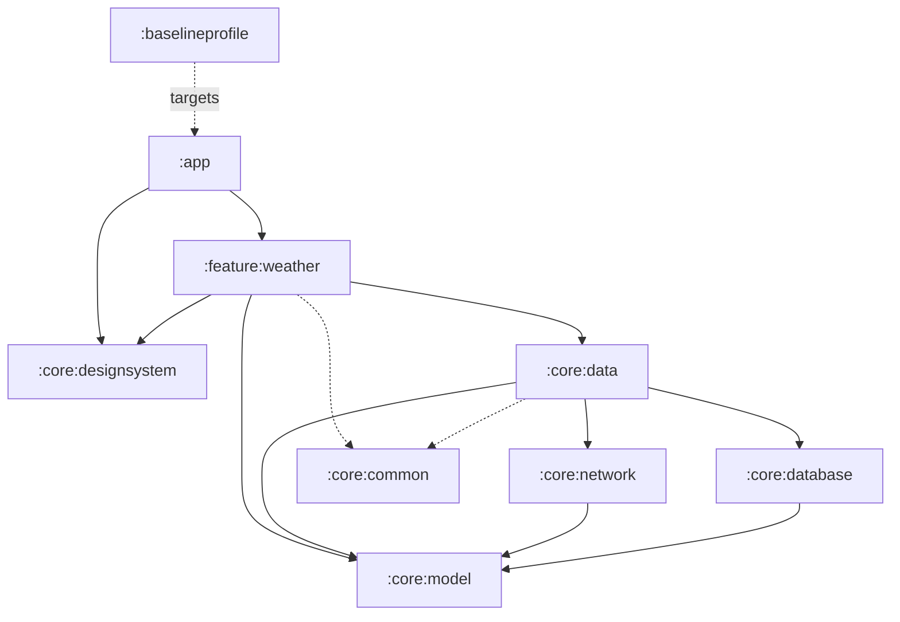

<div align="center">

# Hava Tahminim

**A multi-module Android weather app with an AI activity assistant — built as a reference for modern Android engineering.**

[](https://github.com/erendogan6/HavaTahminim/actions/workflows/ci.yml)
[](https://github.com/erendogan6/HavaTahminim/actions/workflows/security.yml)
[](https://securityscorecards.dev/viewer/?uri=github.com/erendogan6/HavaTahminim)
[](https://kotlinlang.org)
[](https://developer.android.com)
[](LICENSE)

[](https://play.google.com/store/apps/details?id=com.erendogan6.havatahminim)

</div>

---

Hava Tahminim ("My Weather Forecast") shows current, hourly and daily weather for the user's location or any city they pick. Its distinguishing feature is **ZekAI**, a Gemini-powered assistant that reads the forecast and suggests activities for the day. It is published on the Play Store and fully localized in Turkish (default) and English.

This repository is maintained as an **engineering showcase**: the app is real and shipped, but the code is deliberately held to a high bar — full modularization, a zero-mock test suite, screenshot tests, a baseline profile, static analysis, a six-gate CI, security scanning, and a tag-driven signed release to Google Play.

## Screenshots

<table>
  <tr>
    <td></td>
    <td></td>
  </tr>
</table>

▶️ **[30-second demo (YouTube Shorts)](https://www.youtube.com/shorts/5RNjgU8RkFQ)**

## Features

- **Current conditions** for the device location (GPS) or a searched city.
- **Hourly (24 h)** and **daily (7 day)** forecasts.
- **ZekAI assistant** — Gemini suggests daily activities from the forecast and the user's pollen sensitivities.
- **Air quality & pollen** — European AQI plus per-species pollen levels and an intra-day chart.
- **Daily notification** with a pollen alert when a relevant allergen is high.
- **Adaptive layout** — reflows for phone landscape (bottom bar → side rail, two-pane content).
- **Turkish + English**, light drop-shadowed typography over a full-bleed photo background.
- **Accessibility** — TalkBack-first: merged nodes, headings, live error regions, a spoken chart summary.

## Tech stack

| Area | Choice |
|------|--------|
| Language / UI | Kotlin 2.4.10, Jetpack Compose (BOM 2026.06.01), Material 3 |
| Build | AGP 9.3 (built-in Kotlin), Gradle 9.6, version catalog, KSP |
| Architecture | MVVM, per-screen ViewModels, domain-split repositories, `StateFlow` pipelines |
| DI | Hilt |
| Async | Coroutines + Flow |
| Network | Retrofit + OkHttp, Open-Meteo (no API key), `CertificatePinner` |
| Persistence | Room |
| AI | Gemini via **Firebase AI Logic** + App Check (no API key in the app) |
| Observability | Firebase Crashlytics + Analytics, Timber |
| Testing | JUnit4, Truth, Turbine, coroutines-test — **no mocking library, no Robolectric** |
| Quality | detekt (+ktlint rules), Kover coverage, Compose screenshot tests, Macrobenchmark baseline profile |

## Architecture

Ten Gradle modules with a strict dependency direction (`app → feature → data → {network, database} → model`, with `common` shared):



**Key patterns**

- **Single source of truth in the data layer.** Repositories own `activeLocation` and `currentWeather` as `StateFlow`s; every screen pipeline keys off `activeLocation`, so a GPS fix or city selection updates the whole app. Screens never share state through each other's ViewModels.
- **Typed error envelope.** Every cross-process call returns `ApiResult<T>` (`Success` / `Error.Network` / `Error.Http` / `Error.Unknown`) from a single `safeApiCall`; a single `userMessageRes` maps the taxonomy to a localized message at the last mile. Repositories never throw to ViewModels.
- **Per-screen `stateIn(WhileSubscribed(5s))` pipelines** keyed on location: a location change cancels the stale fetch (`transformLatest`), a resubscribe refreshes silently without flashing the splash.
- **Design system.** The raw palette is `internal`; feature/app code only reads `MaterialTheme.colorScheme` / `WeatherTheme.colors` and typed base components (`WeatherText`, `WeatherCard`, …). No hardcoded colors or fonts outside `:core:designsystem` — enforced by detekt.
- **Type-safe navigation** — `@Serializable` route objects and a single `WeatherNavHost` entry point the host module doesn't peek into.

## Engineering & quality

This is where the repository earns its keep.

- **Testing — zero-mock, fake-first.** 146 unit tests with **no mocking library and no Robolectric**. A dedicated `:core:testing` module hosts hand-written fakes that honor each interface's documented contract; platform logic (distance, time, dispatchers) is injected so it stays JVM-testable. ~98% line / ~81% branch coverage (Kover), gated in CI.
- **Screenshot tests.** Every reusable component is a `@Preview` in the `screenshotTest` source set; 14 render as committed golden PNGs compared on every CI run (Compose Preview Screenshot Testing).
- **Baseline profile + benchmarks.** A `:baselineprofile` module walks the critical journey on a Gradle-managed emulator to generate the profile; `StartupBenchmark` and `ScrollBenchmark` (FrameTimingMetric) turn performance into numbers.
- **Static analysis.** detekt with the ktlint formatting ruleset and project-specific import/method bans (Timber over `android.util.Log`, the base components over raw Material 3, injected `Clock` over `System.currentTimeMillis`), wired as a pre-commit hook.
- **CI/CD (GitHub Actions).** `ci.yml` is the merge gate — detekt → tests → `koverVerify` → lint → `assembleRelease` → screenshot validation → coverage PR comment. `security.yml` runs CodeQL, mobsfscan, and dependency review; `scorecard.yml` publishes an OpenSSF score; `deep-scan.yml` runs a full MobSF scan and refreshes the baseline profile weekly; `release.yml` builds a signed AAB on a `v*` tag and ships it to the Play internal track. `main` is protected behind the quality gate.
- **Security.** SSL pinning to the Let's Encrypt roots (release only); Gemini access via Firebase AI Logic + App Check with **no API key shipped in the app**; CodeQL + MobSF + dependency-review + Dependabot.
- **Performance.** Recomposition worked from the Compose compiler reports: stable `LazyList` keys, remembered computations, and a stability configuration file that marks the Compose-free model DTOs stable at the module boundary.

## Decision log

A few choices worth explaining, since they define the codebase:

- **AGP 9 with built-in Kotlin, no `kotlin.android` plugin.** Kotlin *compiler* plugins (Compose, serialization) are fine; the standalone Kotlin *platform* plugins bundle a runtime and cause classloader mixing that broke release builds. This constraint shaped several tooling decisions (Kover ≥ 0.9.8, project-level dependency-analysis, `@PreviewTest` discovery).
- **Zero mocking library.** The architecture was built to be fake-friendly (interfaces + constructor injection + `ApiResult` values instead of thrown exceptions). Hand-written fakes that honor KDoc contracts are more honest than mock expectations and keep tests fast and Robolectric-free.
- **Flat data-class UiState, not sealed.** The states are morally exclusive and render with a fixed `loading > error > content` precedence; the shape is pinned by ViewModel tests instead of the type system.
- **Firebase AI Logic over the raw Gemini SDK.** Removes the API key from the app entirely and gates backend access with App Check (Play Integrity), instead of shipping an extractable key.
- **SSL pinning to CA roots, not leaf/intermediate.** Open-Meteo is a third-party API; pinning a leaf would brick the app on every 90-day renewal, so the stable Let's Encrypt roots are the anchor.

## Build & run

```bash
./gradlew assembleDebug        # build the debug APK
./gradlew installDebug         # build + install on a connected device/emulator
./gradlew testDebugUnitTest    # unit tests
./gradlew koverHtmlReport      # merged coverage report
./gradlew detekt               # static analysis
./gradlew validateDebugScreenshotTest   # compare component renders against goldens
```

No local secrets are required to build. ZekAI runs through Firebase AI Logic, so the committed `google-services.json` identifies the Firebase project (not a secret); the weather/geocoding provider is Open-Meteo, which needs no API key.

**Requirements:** JDK 17, Android SDK (compileSdk 37), a device/emulator on API 26+.

## Project structure

```
:app                 MainActivity + root composable, MainViewModel, notifications, App Check
:feature:weather     Compose screens, navigation, per-screen ViewModels, weather UI
:core:data           Repositories (the only place that touches network + DB), ApiResult mapping
:core:network        Retrofit services, GeminiService, SSL pinning, NetworkModule
:core:database       Room database, DAOs, entities, migrations
:core:common         ResourcesProvider, WMO/pollen/AQI tables, formatters, DI qualifiers
:core:designsystem   Palette, theme, typography, base components (WeatherText/Card/…)
:core:model          Plain DTOs / domain models (no Android deps)
:core:testing        Hand-written fakes, test rules, fixtures (no Hilt/Compose)
:baselineprofile     Baseline profile generator + startup/scroll benchmarks
```

## License

[MIT](LICENSE) © Eren Doğan
