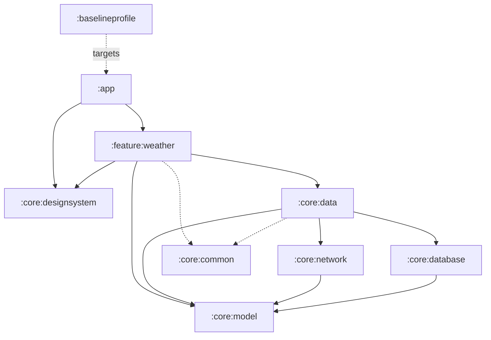

<div align="center">

# Hava Tahminim

**Multi-module Android weather app with a Gemini-powered activity assistant.**

[](https://github.com/erendogan6/HavaTahminim/actions/workflows/ci.yml)
[](https://github.com/erendogan6/HavaTahminim/actions/workflows/security.yml)
[](https://securityscorecards.dev/viewer/?uri=github.com/erendogan6/HavaTahminim)
[](https://kotlinlang.org)
[](https://developer.android.com)
[](LICENSE)

[](https://play.google.com/store/apps/details?id=com.erendogan6.havatahminim)

</div>

Current, hourly and daily weather for the device location or any searched city, with air quality, pollen levels and a daily pollen alert. **ZekAI** (Gemini via Firebase AI Logic) suggests daily activities from the forecast. Localized in Turkish and English; TalkBack-accessible; adaptive layout for landscape.

<table>
  <tr>
    <td></td>
    <td></td>
  </tr>
</table>

▶️ [30-second demo](https://www.youtube.com/shorts/5RNjgU8RkFQ)

## Tech stack

| Area | Choice |
|------|--------|
| Language / UI | Kotlin 2.4.10, Jetpack Compose, Material 3 |
| Build | AGP 9.3 (built-in Kotlin), Gradle 9.6, version catalog, KSP |
| Architecture | MVVM, per-screen ViewModels, domain-split repositories, `StateFlow` |
| DI / Async | Hilt, Coroutines + Flow |
| Network | Retrofit + OkHttp (SSL pinning), Open-Meteo — no API key |
| Persistence | Room |
| AI | Gemini via Firebase AI Logic + App Check — no API key in the app |
| Observability | Crashlytics + Analytics, Timber |
| Quality | detekt + ktlint, Kover, screenshot tests, Macrobenchmark baseline profile |

## Architecture



- Repositories own the app state (`activeLocation`, `currentWeather`) as `StateFlow`s; every screen pipeline keys off the active location.
- All remote calls return a typed `ApiResult` envelope; errors map to localized messages in one place.
- Screens collect `stateIn(WhileSubscribed(5s))` pipelines; a location change cancels stale fetches.
- Design system: `internal` palette, themed base components, no hardcoded colors/fonts outside `:core:designsystem` (detekt-enforced).
- Type-safe navigation with `@Serializable` routes behind a single `WeatherNavHost`.

## Quality

- **146 unit tests, zero mocks** — hand-written fakes in `:core:testing`, no Robolectric; ~98% line / ~81% branch coverage, gated in CI.
- **14 screenshot goldens** validated on every CI run.
- **Baseline profile** + startup and scroll benchmarks (`:baselineprofile`, Gradle-managed emulator).
- **CI/CD**: detekt → tests → coverage gate → lint → release build → screenshot validation; CodeQL, MobSF, dependency review, OpenSSF Scorecard; tag-driven signed AAB to the Play internal track. `main` is branch-protected.

## Build & run

```bash
./gradlew assembleDebug                 # debug APK
./gradlew testDebugUnitTest             # unit tests
./gradlew detekt                        # static analysis
./gradlew koverHtmlReport               # coverage report
./gradlew validateDebugScreenshotTest   # screenshot tests
```

No local secrets required. Requirements: JDK 17, compileSdk 37, device/emulator on API 26+.

## Modules

```
:app                 activity, root composable, notifications, App Check
:feature:weather     screens, navigation, ViewModels
:core:data           repositories, ApiResult mapping
:core:network        Retrofit services, GeminiService, SSL pinning
:core:database       Room, DAOs, migrations
:core:common         resources, domain tables, formatters
:core:designsystem   theme, typography, base components
:core:model          plain DTOs / domain models
:core:testing        fakes, rules, fixtures
:baselineprofile     profile generator + benchmarks
```

## License

[MIT](LICENSE) © Eren Doğan
